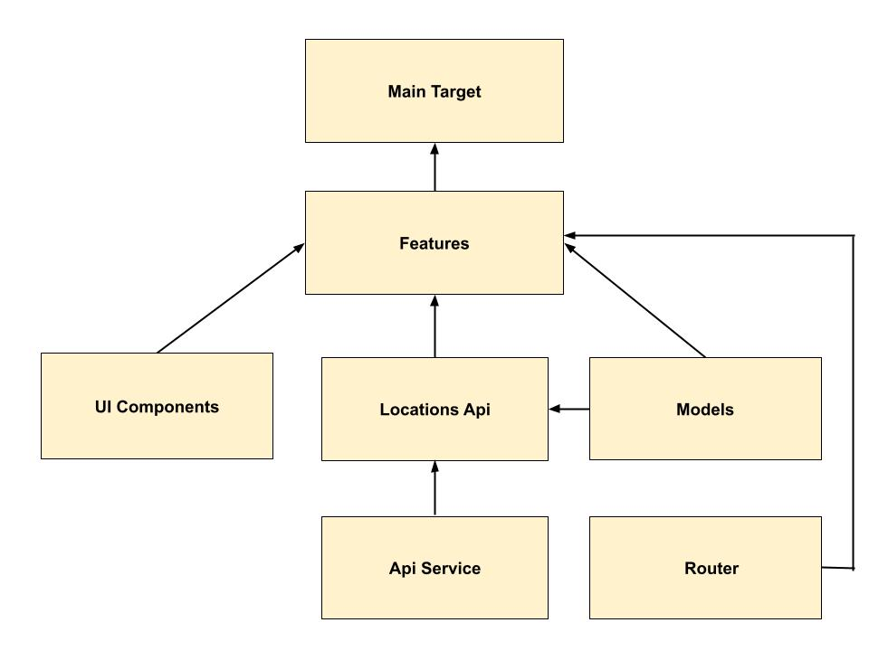

Places
--
Thanks for sending me the assignment.

**Note: Please use Xcode 26+ to run the project.**

For this assignment, I developed the "Places" app, which displays a list of locations using the given API. When a user selects a location, the “Places” app opens the “Wikipedia” app to provide more information about that location. I have also added an option to search for a custom location. When a user enters custom coordinates, the app validates the coordinates and then opens that location in the Wikipedia app.

**📦 Internal packages dependency structure:**

#### In this project:
- To ensure the app structure is scalable, I implemented a modular architecture by dividing the app into multiple Swift Package Manager (SPM) packages. These include the main target, UIComponents, Locations API, API Service, and Models:
  - **Main target:** Contains assets and Main app file.
  - **Features:** Contains feature-specific implementations.
  - **UIComponents:** Hosts reusable UI components and view modifiers.
  - **Locations API:** Manages location-related REST APIs, such as fetching locations.
  - **API Service:** Handles API consumption and is designed for easy expansion in the future.
  - **Models:** Stores networking models and data structures.
  - **Router:** Handles the routing from Places app to Wikipedia.
- **Benefits of this structure:**
  - In medium to large sized teams, modularity reduces merge conflicts in the project file when working on new features.
  - Build times are significantly faster because changes made to a specific package only require that package to be rebuilt, while the rest of the packages remain cached. This not only enhances development efficiency but also reduces CI runtime, which can save costs over time by minimizing resource usage. 
- Developed the UI using `SwiftUI`.
- Followed the `MVVM` architecture.
- Used `Async-Await` for networking.
- Created an `ApiService` class to handle API consumption, with scalability in mind for future expansion.
- Wrote unit tests using the latest `Swift Testing` framework and added test cases for features, Location API, API Service and model layers.

I also cloned and updated the Wikipedia app to support deep linking with location coordinates. I drafted a pull request, which can be found here: https://github.com/raihan/wikipedia-ios/pull/1

#### ▶️ Places App Demo:
https://github.com/user-attachments/assets/e6698a50-c862-42e4-8bd1-436396a47459

